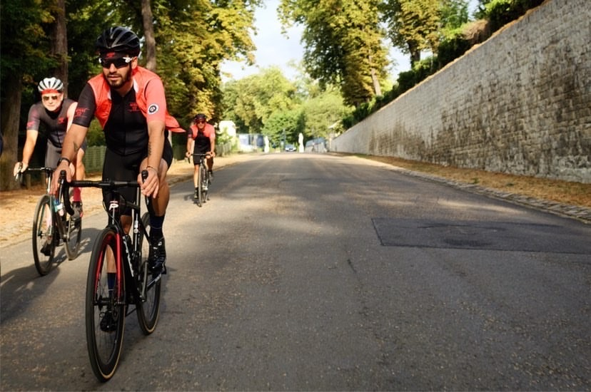
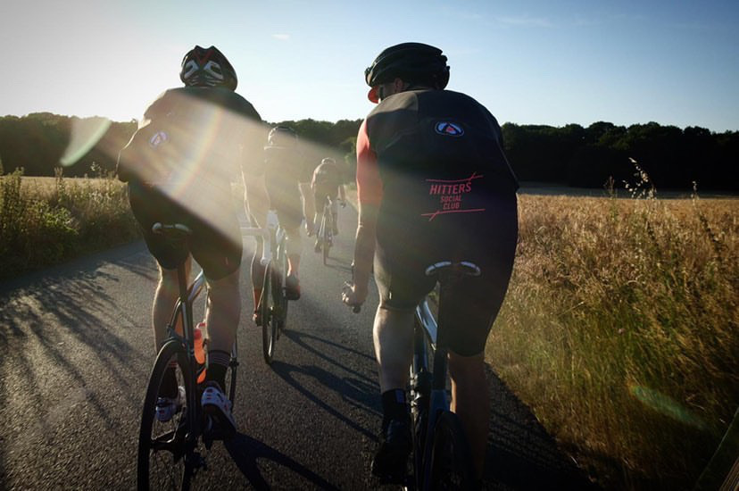
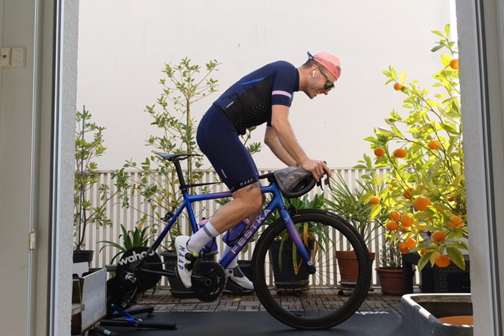

Today, I did an interview to present you Julien Verlay, a nice friend in Paris.

**Can you Introduce yourself ?**\
\
Hello I’m Julien Verlay aka @croaam on Instagram. I’m Parisian, passionate by cycling. I love sharing the road with mates and share experiences from the road. I’m riding for brands that I truly believe in like Festka, Maap, Wahoo, Oakley, 2-11 cycles, Mohawks. I’ve done several sportives around the globe, even if I’m not a racer, I love challenging myself, riding long distances, discover and meet new people from the road.

 **I know you are working for Haute Route, what your job consist in ?**

I’ve started working for Haute Route since Jan 2019, as Market sales manager for Uk and France.  I’m managing the Ambassadors in those countries and activate the community on the ground activities with our partners, Bike shops, clubs, hubs, cafés..

**You did many Haute Route events, which one do you like the most and why ?** 

Yeah I’ve done a few, I’m deeply in love with Pyrénées because it’s wilder than the Alps, I really love Ventoux for everything that means, it used to be my first real climb. So I get very emotional when I’m riding on Ventoux. But honestly, I love all the Haute Route events, because the routes are amazing, the people around are fantastics. It’s a family.

**Did you already plan any haute route for the end of 2020 and 2021 ?**  

Yes, before the Covid19 crisis I’ve planned to ride few Haute Route Dolomites, Crans-Montana, Pyrénées and Ventoux.  So fingers crossed for Ventoux, I hope we could make it. 

**I remember the first time I met you in the bike shop l’Echappée Belle for the launch of the Hitters Social club. Can you tell us more about this club ?**  

This club has been created to keep the community together after spent 4 years by building it in Paris, we felt that we needed to keep the community alive because we all became friends. It was time for us to get our own structure and our own Club. We are a club of 60 members, all involved, all passionated by cycling and having the same philosophy of riding. 

**What lead you to create this club ?**

As you know I used to be involved with Rapha, as the RCC (Rapha cycling Club) coordinator France, and after been fired by the brand I wanted to have my own club and having mates involved with me, I couldn’t manage it all alone with my work, my baby, it would have been very difficult.

**What are the big news for 2020 and 2021 ?  New partnership ? new routes or events ?**

Well, we aren’t really looking for new partnerships or so, we are well supported by Mohawks and l’échappée belle. This year we were supposed to participate to Haute Route Crans-Montana with some of the members and other events with the road mates.

**As we are in quarantine, what do you do to stay in shape ?**  

Like every cyclists I guess, I'm riding my bike on Zwift minimum 1 hour/day, I’m doing some meetups for work, some with friends. I’ve ridden more than 1600km and more 22000m elevation since 6 weeks. I take care of what I eat, so that help. I’ve lost 5 kg since the lockdown has started.

Thanks Julien. 

[Instagram Croaam](http://www.instagram.com/croaam)\
[Son blog](http://lateteetlesjambes.fr/)

