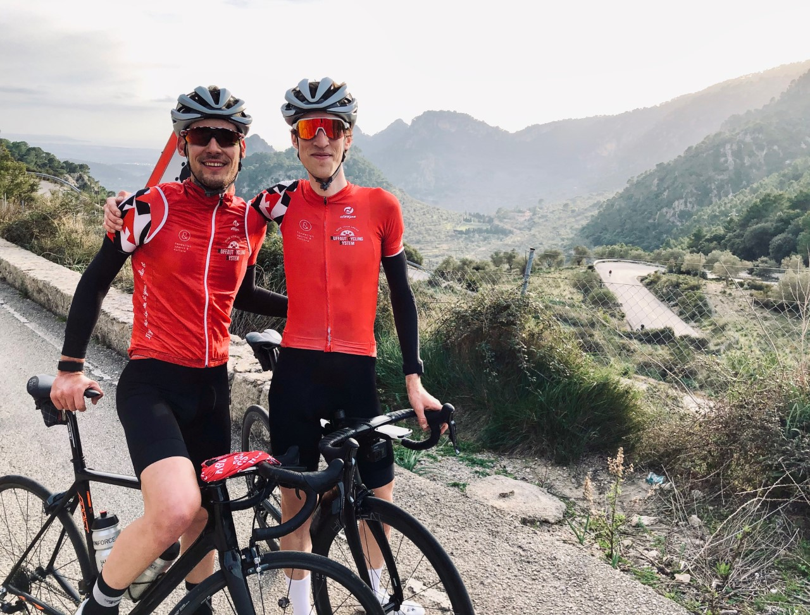

I will present you a strong and nice cyclist friend who lives in Switzerland and create his own company about cycling with his brother : a family affair ! 

**Can you introduce yourself ?**

I’m Pierre Ruffaut and I’m 23 years old. I am French and currently living in Switzerland in Nyon (near to Geneva).

I’m a coach since 3 years now. I’m still racing in FFC and I've decided to prepare the DEJEPS (Diplôme d’État de la Jeunesse, de l’Éducation Populaire et du Sport mention cyclisme traditionnel) to be a sports director. Even if I’m not doing anymore Elite competition, I’m still doing many mountain races. So I’m a coach and also an athlete.

*Ruffaut Cyling system*

**I know you are the founder of Ruffaut Cyling System with your brother, can you tell us more about your company ?**

We have created Ruffaut Cycling system RCS with my brother Loic in November 2018, just after graduating from the DEJEPS. We were in the same class with my brother, so easier for us. We were lucky !\
RCS is a company about cycling for all people who want to do their best and reach a goal, for any level or ages.\
We propose many personalized training plans with power test, sport camp, individual training and group training. We travel across the world to do some races with our RCS team. 

**What lead you to create this company ?**

We have created this company because we are passionate about cycling and we want to help people to reach their goals and share our passion. We want to share our experiences to others cyclists and offer them special moments, like a pro cyclist, that's why we do sport camp.\
For me, a best coach, above all, has to be human and be able to help any athletes to reach their goal, no matter the level. This is an amazing satisfaction when your athletes achieve his goal.

**What your job consist in ? Same as your brother or different tasks ?**

My job is to be a cyclist coach with the creation of training plans. Each training plan is personalized regarding the goal, profile and performance of the cyclist. There is also the organisation of sports camp and races with all logistics (hotel's reservation, creation of routes…). As we are only 2, with my brother Loic, we do everything, like communication and administrative part, even if it’s not fun ahaha ! To help us a little bit, this year we hired an intern, a good support. We are a good team and we do our best to propose a nice experience to our clients!

**What are the news in your company for the next months ?** 

With the Covid-19, it’s a bit complicated to organize sports camp as we can’t go outside the country. Many for our sports camp are postponed. We were supposed to do the GF Schleck, Haute Route, Etape du Tour, all are cancelled or postponed later. So we just need to wait and see what the Swiss government said. We hope that we can organize swiss camp in the end of summer but we've to wait before taking a decision. But in the meantime, we start to fulfill the 2021 calendar with races.

We have the chance to work with [Katusha](https://katusha-sports.com/?lang=fr) for the kit, a nice cyclist brand and we'll start to work with [Motion-Lab](https://www.motion-lab.ch/) which is a sports center in Lausanne. Since several months, we are working on a big project: the opening of a bike and coffee shop in Nyon. The launch will be at the end of the year. There is a lovely synergy that developed within this project.

*Cycling – Triathlon*

**When and why did you start cycling ?**

I start cycling when I was kid at 10 years old. I always did cycling or gravel around my house, I liked it. After doing tennis during 7 years with my brother, he decided to stop and start cycling so I did the same not to be alone. We started cycling and it was a big crush for both of us !

**What are your best memories in cycling ? (Race, HC climb, performance…)**

I have many nice memories in cycling. But If I need to choose, It would be my victory at Grand Prix of Domérat in 2015, with my brother. We arrived in the finish line hand to hand after spent all time in first position. This moment will stay in my thoughts forever.

Another good memories would be the Haute Route Ventoux (3days) in 2019 with 7 RCS cyclists. It was a nice weekend with a good spirit and help us to push each other. During this race, I took the win, just before my friend Kevin Boscardin, who is a strong cyclist of our team RCS. It was an amazing weekend.

**I know you live in Switzerland, which routes is a must-see in your area and which climb do you like the most ?**

There are many beautiful roads and sceneries in my area, around the Léman lake. My favorite climb, near to my home is “La montée de la Barillette” with 12km about 8% with a nice view at the summit.\
I like also the climb of “Saint Gotthard” a long climb with paving stones and many winding road. You have to do it ! \
I have to explore more routes so maybe my favorite route will change soon !

**I saw that you do also triathlon, what push you to do this sport ? I do triathlon also and it’s quite hard to manage triathlon training + cycling training at the same time, how do you do ?**

I wanted to discover new sports, explore new sensations and reach new goals. A desire to change my routine by practicing new sports like swimming and running. In 2019, I wanted to perform in cycling race and long distance triathlon. With my full time job and my cycling training it was hard to find time to do running and swimming so I didn’t do the 70.3 Vichy. But I did a Half triathlon in September 2019 and I liked it. So in 2020, my goal was to do more triathlon race but with the covid-19 my plan has changed. But whatever, I enjoy this time to learn being a better swimmer by swimming in the Léman lack.

[ruffaut cycling system](https://ruffaut-cycling-system.com)

