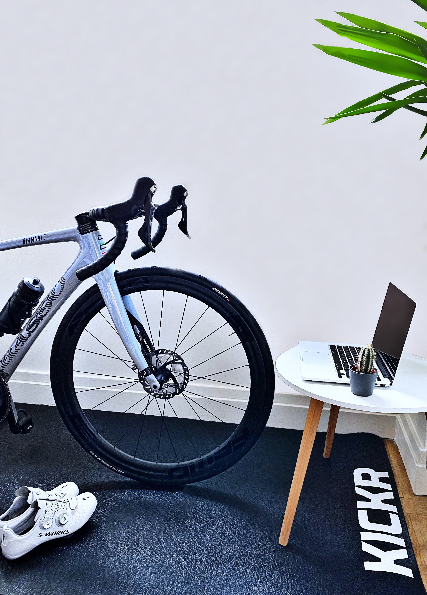
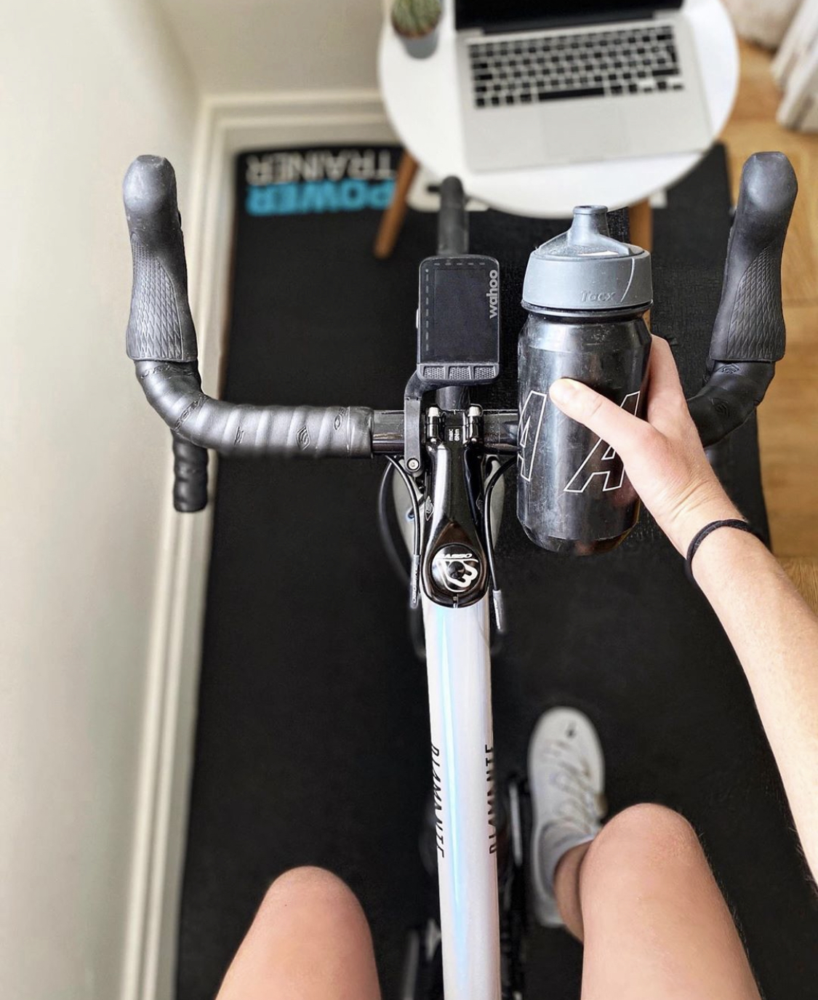
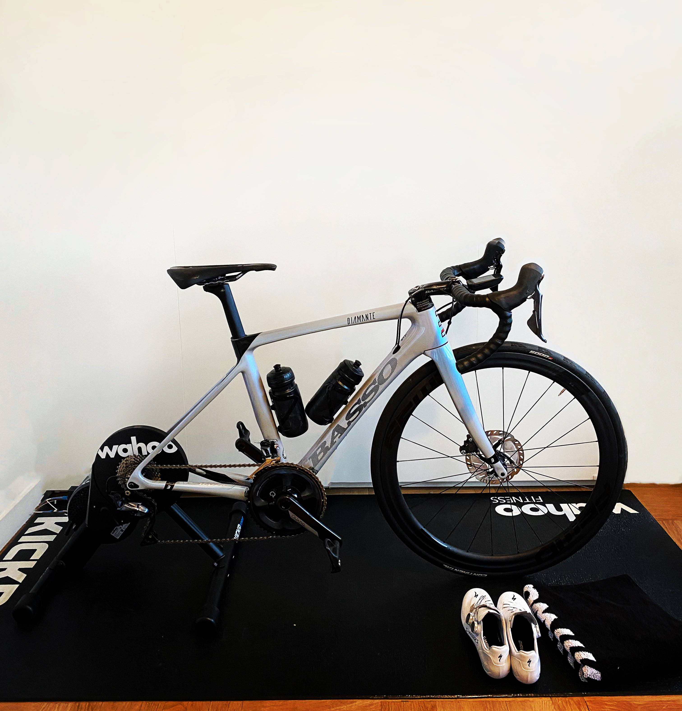

My set-up Wahoo

Since 2019, I use to do indoor training in my turbo WAHOO KICKR CORE Smart Trainer. For me, it’s the best home trainer regarding the price and the quality. It’s really easy to use (very important for me ahah) and with ZWIFT it’s the perfect combo for a nice performance indoor training. \
KICKR CORE Smart Trainer delivers a realistic and quiet indoor training experience by using the proven flywheel technology, advanced algorithms, and integrated cadence measurement that originated with the iconic KICKR smart trainer.

I use the KICKR Trainer Floormat, It's water resistant and anti-slip to keep the trainer in place. It's also remarkably durable.\
I have the Wahoo Sweat Towel, it's a great thick and soft towel and I'm very pleased to have it.\

Tips : buy a ANT+ key for a better connection with your home trainer, it’s faster that Bluetooth. 
For the KICKR Core, you just need to buy a cassette and you are ready to rock and roll. 

[Website Wahoo](https://eu.wahoofitness.com/)